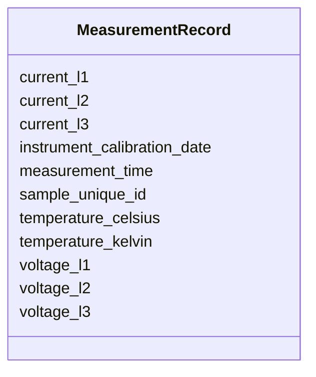

# Class: MeasurementRecord


_Single measurement event (Temperature or 3-Phase Power)._


URI: [regimo:MeasurementRecord](https://example.org/regimo/MeasurementRecord)





<!-- no inheritance hierarchy -->


## Slots

| Name | Cardinality and Range | Description | Inheritance |
| ---  | --- | --- | --- |
| [sample_unique_id](sample_unique_id.md) | 1 <br/> [String](String.md) |  | direct |
| [measurement_time](measurement_time.md) | 1 <br/> [Datetime](Datetime.md) |  | direct |
| [instrument_calibration_date](instrument_calibration_date.md) | 1 <br/> [Date](Date.md) |  | direct |
| [temperature_celsius](temperature_celsius.md) | 0..1 <br/> [Float](Float.md) |  | direct |
| [temperature_kelvin](temperature_kelvin.md) | 0..1 <br/> [Float](Float.md) |  | direct |
| [voltage_l1](voltage_l1.md) | 0..1 <br/> [Float](Float.md) | Voltage on Phase 1 (Target 230V) | direct |
| [voltage_l2](voltage_l2.md) | 0..1 <br/> [Float](Float.md) |  | direct |
| [voltage_l3](voltage_l3.md) | 0..1 <br/> [Float](Float.md) |  | direct |
| [current_l1](current_l1.md) | 0..1 <br/> [Float](Float.md) | Current on Phase 1 (Max 16A for standard lab socket) | direct |
| [current_l2](current_l2.md) | 0..1 <br/> [Float](Float.md) |  | direct |
| [current_l3](current_l3.md) | 0..1 <br/> [Float](Float.md) |  | direct |


## Usages

| used by | used in | type | used |
| ---  | --- | --- | --- |
| [ProjectSubmission](ProjectSubmission.md) | [records](records.md) | range | [MeasurementRecord](MeasurementRecord.md) |


## Identifier and Mapping Information


### Schema Source


* from schema: https://example.org/regimo/metadata_integrity_schema


## Mappings

| Mapping Type | Mapped Value |
| ---  | ---  |
| self | regimo:MeasurementRecord |
| native | regimo:MeasurementRecord |


## LinkML Source

<!-- TODO: investigate https://stackoverflow.com/questions/37606292/how-to-create-tabbed-code-blocks-in-mkdocs-or-sphinx -->

### Direct

<details>
```yaml
name: MeasurementRecord
description: Single measurement event (Temperature or 3-Phase Power).
from_schema: https://example.org/regimo/metadata_integrity_schema
slots:
- sample_unique_id
- measurement_time
- instrument_calibration_date
- temperature_celsius
- temperature_kelvin
- voltage_l1
- voltage_l2
- voltage_l3
- current_l1
- current_l2
- current_l3

```
</details>

### Induced

<details>
```yaml
name: MeasurementRecord
description: Single measurement event (Temperature or 3-Phase Power).
from_schema: https://example.org/regimo/metadata_integrity_schema
attributes:
  sample_unique_id:
    name: sample_unique_id
    from_schema: https://example.org/regimo/metadata_integrity_schema
    rank: 1000
    alias: sample_unique_id
    owner: MeasurementRecord
    domain_of:
    - MeasurementRecord
    range: string
    required: true
    pattern: ^SAMPLE-\d{3}$
  measurement_time:
    name: measurement_time
    from_schema: https://example.org/regimo/metadata_integrity_schema
    rank: 1000
    alias: measurement_time
    owner: MeasurementRecord
    domain_of:
    - MeasurementRecord
    range: datetime
    required: true
  instrument_calibration_date:
    name: instrument_calibration_date
    from_schema: https://example.org/regimo/metadata_integrity_schema
    rank: 1000
    alias: instrument_calibration_date
    owner: MeasurementRecord
    domain_of:
    - MeasurementRecord
    range: date
    required: true
  temperature_celsius:
    name: temperature_celsius
    from_schema: https://example.org/regimo/metadata_integrity_schema
    rank: 1000
    alias: temperature_celsius
    owner: MeasurementRecord
    domain_of:
    - MeasurementRecord
    range: float
    minimum_value: 10
    maximum_value: 40
  temperature_kelvin:
    name: temperature_kelvin
    from_schema: https://example.org/regimo/metadata_integrity_schema
    rank: 1000
    alias: temperature_kelvin
    owner: MeasurementRecord
    domain_of:
    - MeasurementRecord
    range: float
    minimum_value: 283.15
    maximum_value: 313.15
  voltage_l1:
    name: voltage_l1
    description: Voltage on Phase 1 (Target 230V)
    from_schema: https://example.org/regimo/metadata_integrity_schema
    rank: 1000
    alias: voltage_l1
    owner: MeasurementRecord
    domain_of:
    - MeasurementRecord
    range: float
    minimum_value: 200
    maximum_value: 250
  voltage_l2:
    name: voltage_l2
    from_schema: https://example.org/regimo/metadata_integrity_schema
    rank: 1000
    alias: voltage_l2
    owner: MeasurementRecord
    domain_of:
    - MeasurementRecord
    range: float
    minimum_value: 200
    maximum_value: 250
  voltage_l3:
    name: voltage_l3
    from_schema: https://example.org/regimo/metadata_integrity_schema
    rank: 1000
    alias: voltage_l3
    owner: MeasurementRecord
    domain_of:
    - MeasurementRecord
    range: float
    minimum_value: 200
    maximum_value: 250
  current_l1:
    name: current_l1
    description: Current on Phase 1 (Max 16A for standard lab socket)
    from_schema: https://example.org/regimo/metadata_integrity_schema
    rank: 1000
    alias: current_l1
    owner: MeasurementRecord
    domain_of:
    - MeasurementRecord
    range: float
    minimum_value: 0
    maximum_value: 16
  current_l2:
    name: current_l2
    from_schema: https://example.org/regimo/metadata_integrity_schema
    rank: 1000
    alias: current_l2
    owner: MeasurementRecord
    domain_of:
    - MeasurementRecord
    range: float
    minimum_value: 0
    maximum_value: 16
  current_l3:
    name: current_l3
    from_schema: https://example.org/regimo/metadata_integrity_schema
    rank: 1000
    alias: current_l3
    owner: MeasurementRecord
    domain_of:
    - MeasurementRecord
    range: float
    minimum_value: 0
    maximum_value: 16

```
</details>