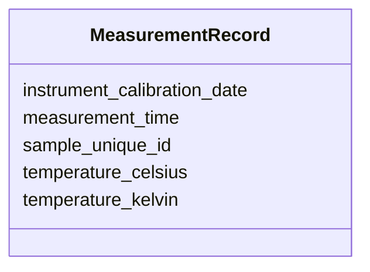

# Class: MeasurementRecord


_Single temperature measurement with provenance_


URI: [regimo:MeasurementRecord](https://example.org/regimo/MeasurementRecord)





<!-- no inheritance hierarchy -->


## Slots

| Name | Cardinality and Range | Description | Inheritance |
| ---  | --- | --- | --- |
| [sample_unique_id](sample_unique_id.md) | 1 <br/> [String](String.md) | Unique identifier of the sample | direct |
| [measurement_time](measurement_time.md) | 1 <br/> [Datetime](Datetime.md) | Date and time of the measurement | direct |
| [instrument_calibration_date](instrument_calibration_date.md) | 1 <br/> [Date](Date.md) | Date the instrument was last calibrated | direct |
| [temperature_celsius](temperature_celsius.md) | 0..1 <br/> [Float](Float.md) | Room temperature measured in degrees Celsius | direct |
| [temperature_kelvin](temperature_kelvin.md) | 0..1 <br/> [Float](Float.md) | Room temperature measured in Kelvin | direct |


## Usages

| used by | used in | type | used |
| ---  | --- | --- | --- |
| [ProjectSubmission](ProjectSubmission.md) | [records](records.md) | range | [MeasurementRecord](MeasurementRecord.md) |


## Identifier and Mapping Information


### Schema Source


* from schema: https://example.org/regimo/metadata_integrity_schema


## Mappings

| Mapping Type | Mapped Value |
| ---  | ---  |
| self | regimo:MeasurementRecord |
| native | regimo:MeasurementRecord |


## LinkML Source

<!-- TODO: investigate https://stackoverflow.com/questions/37606292/how-to-create-tabbed-code-blocks-in-mkdocs-or-sphinx -->

### Direct

<details>
```yaml
name: MeasurementRecord
description: Single temperature measurement with provenance
from_schema: https://example.org/regimo/metadata_integrity_schema
slots:
- sample_unique_id
- measurement_time
- instrument_calibration_date
- temperature_celsius
- temperature_kelvin
exactly_one_of:
- slot_conditions:
    temperature_celsius:
      name: temperature_celsius
      required: true
- slot_conditions:
    temperature_kelvin:
      name: temperature_kelvin
      required: true

```
</details>

### Induced

<details>
```yaml
name: MeasurementRecord
description: Single temperature measurement with provenance
from_schema: https://example.org/regimo/metadata_integrity_schema
attributes:
  sample_unique_id:
    name: sample_unique_id
    description: 'Unique identifier of the sample. Must follow the pattern SAMPLE-NNN
      (e.g. SAMPLE-001).

      '
    from_schema: https://example.org/regimo/metadata_integrity_schema
    rank: 1000
    alias: sample_unique_id
    owner: MeasurementRecord
    domain_of:
    - MeasurementRecord
    range: string
    required: true
    pattern: ^SAMPLE-\d{3}$
  measurement_time:
    name: measurement_time
    description: Date and time of the measurement
    from_schema: https://example.org/regimo/metadata_integrity_schema
    rank: 1000
    alias: measurement_time
    owner: MeasurementRecord
    domain_of:
    - MeasurementRecord
    range: datetime
    required: true
  instrument_calibration_date:
    name: instrument_calibration_date
    description: Date the instrument was last calibrated
    from_schema: https://example.org/regimo/metadata_integrity_schema
    rank: 1000
    alias: instrument_calibration_date
    owner: MeasurementRecord
    domain_of:
    - MeasurementRecord
    range: date
    required: true
  temperature_celsius:
    name: temperature_celsius
    description: 'Room temperature measured in degrees Celsius. Valid range: 10–40
      °C.

      '
    from_schema: https://example.org/regimo/metadata_integrity_schema
    rank: 1000
    alias: temperature_celsius
    owner: MeasurementRecord
    domain_of:
    - MeasurementRecord
    range: float
    minimum_value: 10
    maximum_value: 40
  temperature_kelvin:
    name: temperature_kelvin
    description: 'Room temperature measured in Kelvin. Valid range: 283.15–313.15
      K.

      '
    from_schema: https://example.org/regimo/metadata_integrity_schema
    rank: 1000
    alias: temperature_kelvin
    owner: MeasurementRecord
    domain_of:
    - MeasurementRecord
    range: float
    minimum_value: 283.15
    maximum_value: 313.15
exactly_one_of:
- slot_conditions:
    temperature_celsius:
      name: temperature_celsius
      required: true
- slot_conditions:
    temperature_kelvin:
      name: temperature_kelvin
      required: true

```
</details>