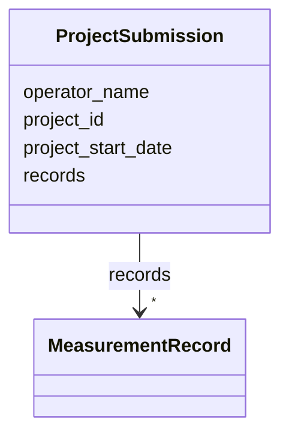

# Class: ProjectSubmission


_Container for one or more measurement records_


URI: [regimo:ProjectSubmission](https://example.org/regimo/ProjectSubmission)





<!-- no inheritance hierarchy -->


## Slots

| Name | Cardinality and Range | Description | Inheritance |
| ---  | --- | --- | --- |
| [project_id](project_id.md) | 1 <br/> [String](String.md) | Unique project identifier | direct |
| [operator_name](operator_name.md) | 1 <br/> [String](String.md) | Person responsible for the measurement | direct |
| [project_start_date](project_start_date.md) | 1 <br/> [Date](Date.md) | Date when the project officially started | direct |
| [records](records.md) | * <br/> [MeasurementRecord](MeasurementRecord.md) | List of all measurement records in this submission | direct |


## Identifier and Mapping Information


### Schema Source


* from schema: https://example.org/regimo/metadata_integrity_schema


## Mappings

| Mapping Type | Mapped Value |
| ---  | ---  |
| self | regimo:ProjectSubmission |
| native | regimo:ProjectSubmission |


## LinkML Source

<!-- TODO: investigate https://stackoverflow.com/questions/37606292/how-to-create-tabbed-code-blocks-in-mkdocs-or-sphinx -->

### Direct

<details>
```yaml
name: ProjectSubmission
description: Container for one or more measurement records
from_schema: https://example.org/regimo/metadata_integrity_schema
slots:
- project_id
- operator_name
- project_start_date
- records
tree_root: true

```
</details>

### Induced

<details>
```yaml
name: ProjectSubmission
description: Container for one or more measurement records
from_schema: https://example.org/regimo/metadata_integrity_schema
attributes:
  project_id:
    name: project_id
    description: 'Unique project identifier. Must follow the pattern REGIMO-YYYY-NNN
      (e.g. REGIMO-2025-001).

      '
    from_schema: https://example.org/regimo/metadata_integrity_schema
    rank: 1000
    identifier: true
    alias: project_id
    owner: ProjectSubmission
    domain_of:
    - ProjectSubmission
    range: string
    required: true
    pattern: ^REGIMO-\d{4}-\d{3}$
  operator_name:
    name: operator_name
    description: Person responsible for the measurement
    from_schema: https://example.org/regimo/metadata_integrity_schema
    rank: 1000
    alias: operator_name
    owner: ProjectSubmission
    domain_of:
    - ProjectSubmission
    range: string
    required: true
  project_start_date:
    name: project_start_date
    description: Date when the project officially started
    from_schema: https://example.org/regimo/metadata_integrity_schema
    rank: 1000
    alias: project_start_date
    owner: ProjectSubmission
    domain_of:
    - ProjectSubmission
    range: date
    required: true
  records:
    name: records
    description: List of all measurement records in this submission
    from_schema: https://example.org/regimo/metadata_integrity_schema
    rank: 1000
    alias: records
    owner: ProjectSubmission
    domain_of:
    - ProjectSubmission
    range: MeasurementRecord
    multivalued: true
    inlined: true
    inlined_as_list: true
tree_root: true

```
</details>