# GraphON Data Ingestion CLI Structure

```mermaid
flowchart TD
    subgraph CLI["oep-cli - Main Entry Point"]
        root[oep_cli<br/>Main Group]
    end

    subgraph Info["info - Database Inspection"]
        info_group[info group]
        info_neo[neo<br/>Verify Neo4j connection]
        info_tables[tables<br/>List OEP table names<br/>--schema, --format]
        info_counts[counts<br/>Show record counts]
        info_status[status<br/>System status overview]
    end

    subgraph Data["data - Fetch & Manage Raw Data"]
        data_group[data group]
        data_fetch[fetch<br/>Fetch from OEP<br/>--source, --tables, --output, --schema]
        data_restore[restore<br/>Restore from export<br/>--source, --path]
        data_preprocess[preprocess<br/>Preprocess fetched data<br/>--source, --tables]
        data_metadata[metadata<br/>Fetch table metadata<br/>--table, --schema, --output, --via-client]
    end

    subgraph Graph["graph - Merge & Manage Graph"]
        graph_group[graph group]
        graph_merge[merge<br/>Merge into graph<br/>--source, --tables, --dry-run]
        graph_backup[backup<br/>Create graph backup<br/>--backup-path]
        graph_restore[restore<br/>Restore from backup<br/>--path]
        graph_clear[clear<br/>Clear all data<br/>confirmation required]
    end

    subgraph Modules["External Modules"]
        get_meta[get_meta.py<br/>get_table_names<br/>get_table_metadata]
        neo_ingest[neo_ingest_oep<br/>fetch_from_oep<br/>merge_oep_into_graph<br/>etc.]
        neo4j[Neo4j Driver]
    end

    root --> info_group
    root --> data_group
    root --> graph_group

    info_group --> info_neo
    info_group --> info_tables
    info_group --> info_counts
    info_group --> info_status

    data_group --> data_fetch
    data_group --> data_restore
    data_group --> data_preprocess
    data_group --> data_metadata

    graph_group --> graph_merge
    graph_group --> graph_backup
    graph_group --> graph_restore
    graph_group --> graph_clear

    info_tables -.->|uses| get_meta
    data_fetch -.->|uses| get_meta
    data_fetch -.->|calls| neo_ingest
    data_metadata -.->|uses| get_meta
    data_preprocess -.->|calls| neo_ingest
    data_restore -.->|calls| neo_ingest
    graph_merge -.->|calls| neo_ingest
    
    info_neo -.->|connects| neo4j
    info_counts -.->|queries| neo4j
    info_status -.->|checks| neo4j

    style CLI fill:#e1f5ff
    style Info fill:#fff4e1
    style Data fill:#e8f5e9
    style Graph fill:#fce4ec
    style Modules fill:#f3e5f5
```

## Command Hierarchy

| Group | Command | Description | Key Options |
|-------|---------|-------------|-------------|
| **info** | `neo` | Verify Neo4j connectivity | — |
| | `tables` | List OEP table names | `--schema`, `--format` (list/json) |
| | `counts` | Show record counts per table | — |
| | `status` | Overall system status | — |
| **data** | `fetch` | Fetch data from OEP | `--source`, `--tables`, `--output`, `--schema` |
| | `restore` | Restore from previous export | `--source`, `--path` |
| | `preprocess` | Preprocess fetched data | `--source`, `--tables` |
| | `metadata` | Fetch single table metadata | `--table`, `--schema`, `--output`, `--via-client` |
| **graph** | `merge` | Merge data into graph | `--source`, `--tables`, `--dry-run` |
| | `backup` | Create graph backup | `--backup-path` |
| | `restore` | Restore graph from backup | `--path` |
| | `clear` | Clear all graph data | confirmation prompt |

## Module Dependencies

- **get_meta.py**: Provides `get_table_names()` and `get_table_metadata()` for flexible OEP metadata access
- **neo_ingest_oep**: Core ingestion logic (fetch, preprocess, merge, backup/restore)
- **Neo4j Driver**: Direct database connections for inspection commands
